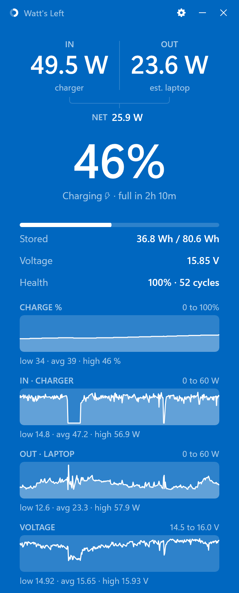

# Watt's Left

**See how fast your laptop is charging or draining, live, in watts.**

&nbsp;

 

  

## What it shows

- **IN** &nbsp;watts flowing from the charger into the battery. Higher is faster charging.
- **OUT** &nbsp;watts the laptop is drawing from the battery. Lower lasts longer.
- **Time left** &nbsp;stored energy divided by your average draw over the last five minutes, refreshed every thirty seconds.
- **Stored energy** in watt-hours, **voltage**, **health** against design capacity, and **cycle count**.
- **Thirty-minute graphs** of charge, watts in, watts out and voltage, kept across restarts.
- The live **percent in your tray icon.** Hover any number for a one-sentence explanation.

## Overview

Watt's Left is a free, open-source Windows app that shows, live, how many watts your charger
is putting into your laptop battery and how many watts your laptop is drawing out, plus time
left, stored energy, voltage and battery health. One small window. No account, no ads, no
tracking, and it never touches the network. More at [wattsleft.app](https://wattsleft.app).

**Requirements:** Windows 10 or 11, and a laptop with a battery. The Store package and the
installer each carry everything they need, with nothing else to set up.

## How it works

Windows itself only shows a percent. Watt's Left reads the battery hardware directly through
the Windows battery interface (`IOCTL_BATTERY_QUERY_STATUS`, which reports the rate in
milliwatts) four times a second, and turns it into the numbers above. The result is one small
window that stays out of the way, plus the live percent on your tray icon.

## Privacy

No network connections at all. Nothing is uploaded, and there is no account, no analytics,
and no ads. Your settings and the last half hour of readings live in the app's own private
folder on your machine, and they are removed when you uninstall. Full
[Privacy Policy](https://wattsleft.app/privacy/).

## What's with the little dancing guy?

I have literally no idea what you're talking about. Next question.

## License

MIT. See [LICENSE](LICENSE). Made by [Aron Frishberg](https://aronfrishberg.com/).
